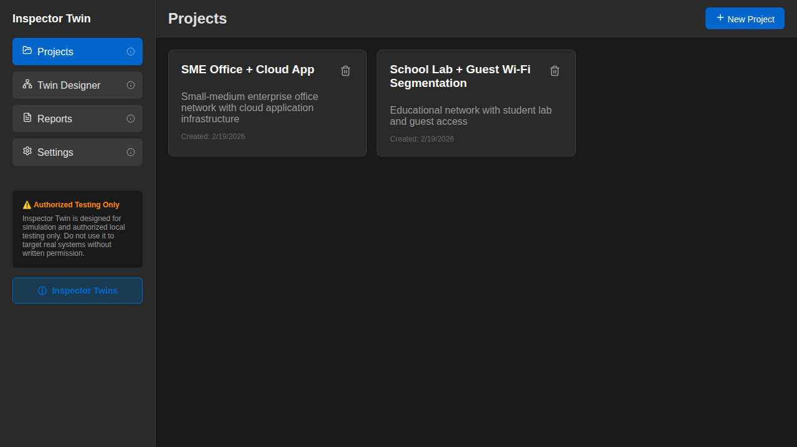
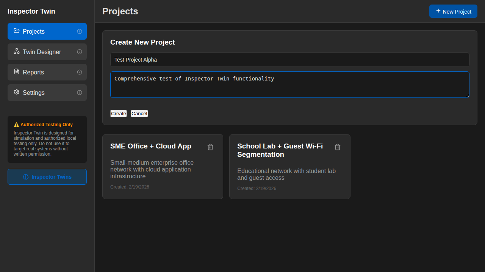
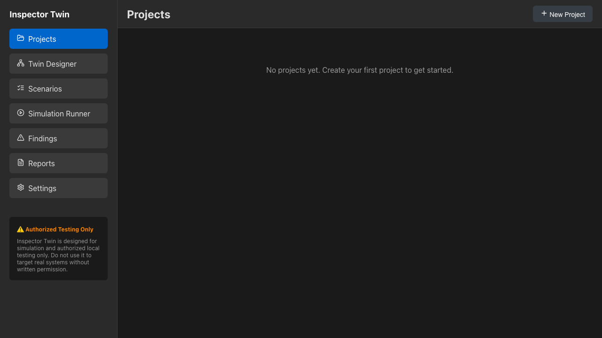
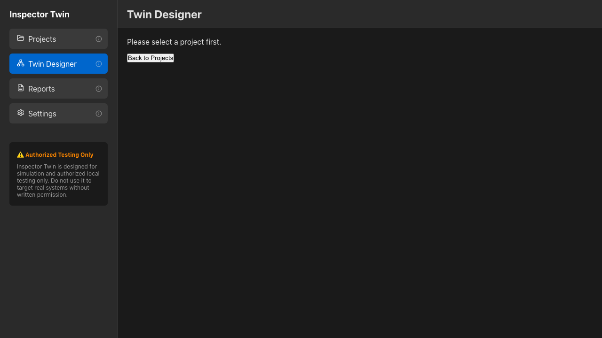
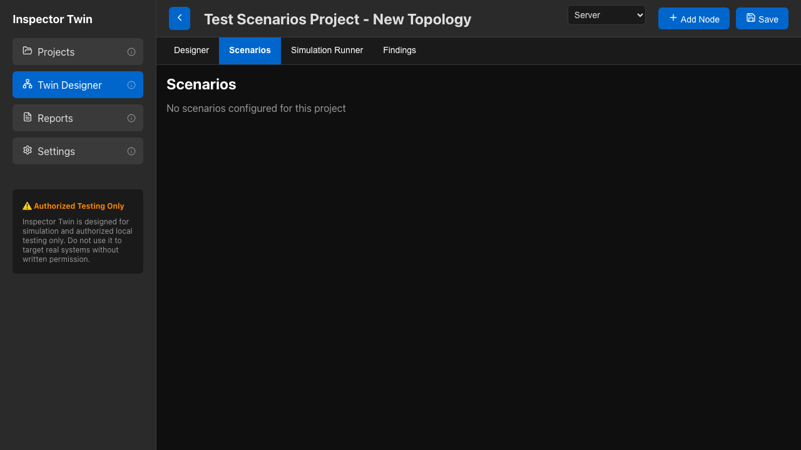
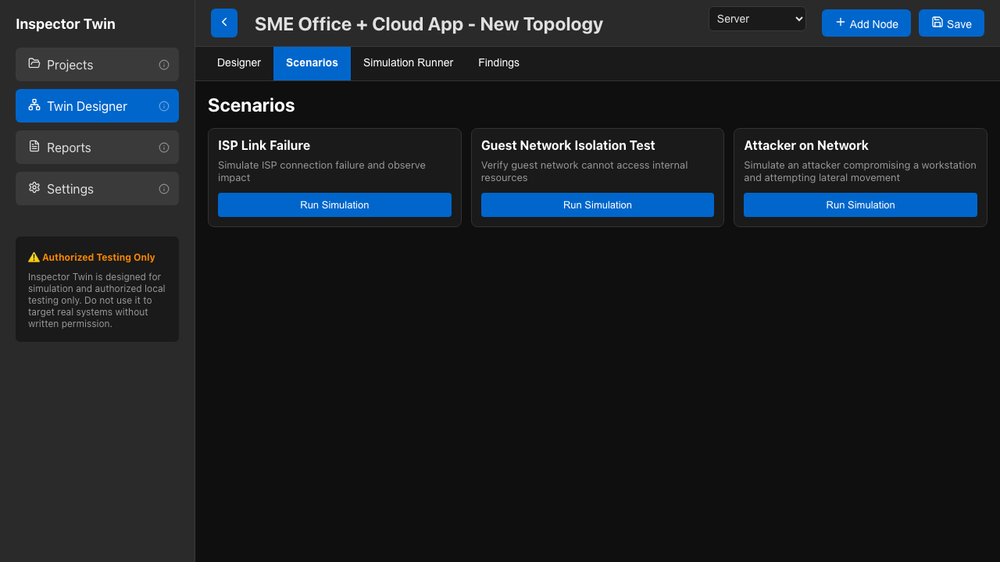
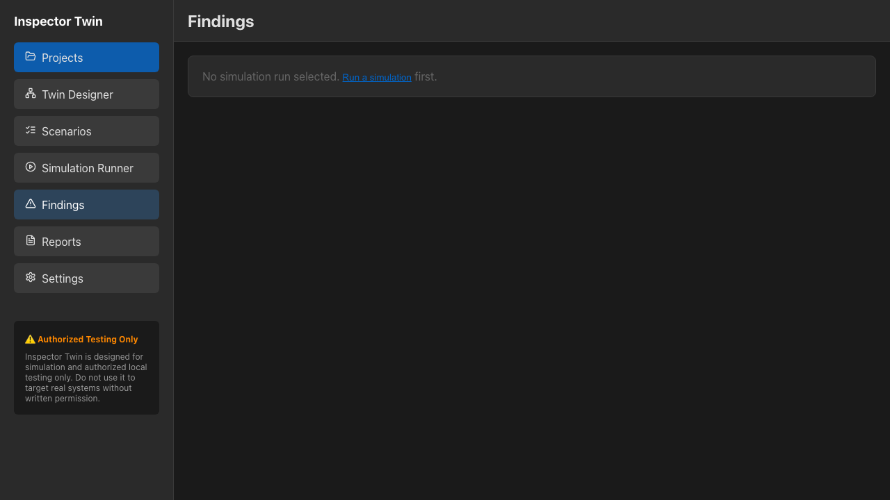
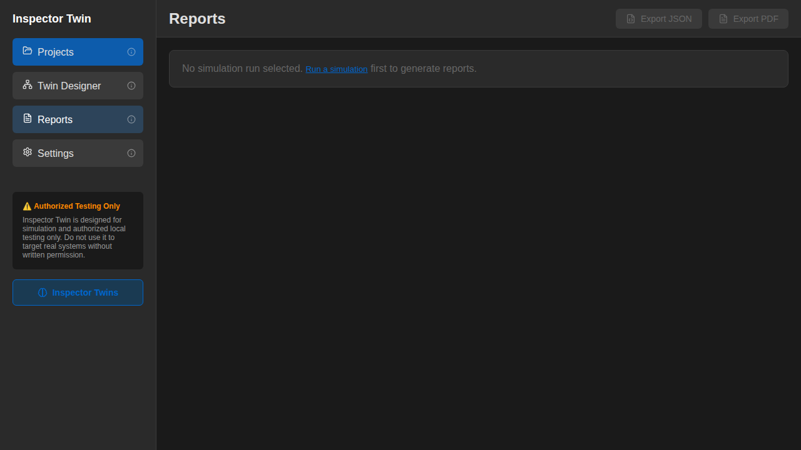
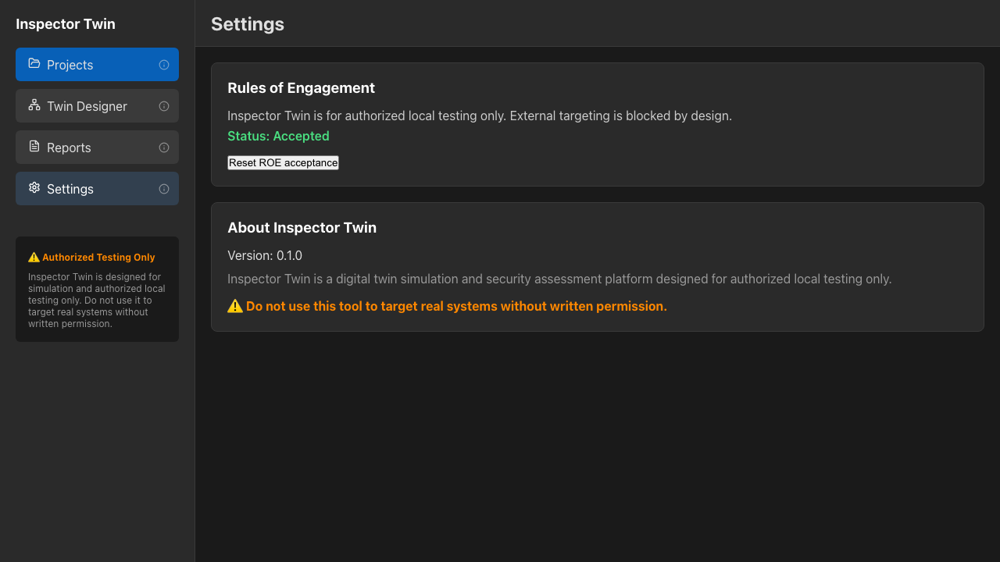

# Inspector Twin

**Digital Twin Simulation and Security Assessment Platform**

Inspector Twin is a modern desktop application built with Tauri that enables organizations to create digital twins of their physical and digital environments, run safe simulations, and perform authorized local security assessments.

## ⚠️ Important Notice

**Inspector Twin is designed for simulation and authorized local testing only.**

Do not use this tool to target real systems without written permission. The application enforces local-only constraints by default and includes safety mechanisms to prevent misuse.

## Features

### Modern Application Architecture

- **Tab-Based Interface**: Scenarios, Simulation Runner, and Findings are integrated as tabs within Twin Designer for streamlined workflow
- **4-Page Navigation**: Projects, Twin Designer, Reports, and Settings in the sidebar
- **Browser-Compatible**: Full functionality available in modern browsers (Chrome, Firefox, Edge) for testing
- **Hot Reload**: Instant updates during development with Vite HMR
- **Responsive Design**: Optimized for desktop viewing at 1920x1080

### Digital Twin Designer

- Drag-and-drop topology canvas using React Flow
- **49 device types** across 6 categories:
  - **Network Infrastructure**: Router, Switch, Firewall, Load Balancer, VPN Gateway, Proxy Server, NAT Gateway, DNS Server
  - **End User Devices**: Workstation, Laptop, Mobile Device, Tablet, Thin Client, Printer, IP Phone, Smart TV
  - **Servers & Services**: Web Server, App Server, Database Server, File Server, Mail Server, API Server, Cache Server, Backup Server
  - **IoT & Embedded**: IoT Gateway, Smart Sensor, Camera, Access Control, HVAC Controller, Industrial PLC, Smart Lock, Environmental Monitor
  - **Cloud & Virtual**: Cloud VM, Container, Cloud Storage, Cloud DB, Cloud CDN, Cloud Function, Cloud Gateway, Cloud Firewall
  - **Security Devices**: IDS/IPS, SIEM, Honeypot, Security Gateway, Threat Intel Feed, Log Collector, Forensic Workstation, Security Scanner
- Visual link configuration with bandwidth, latency, and failure simulation
- Property panels for detailed node/link configuration
- Integrated tabs: Designer, Scenarios, Simulation Runner, and Findings
- Firewall policy DSL for security rules

### Simulation Engine

- Packet flow animation and routing simulation
- Firewall policy evaluation
- Failure injection (link down, degradation, node failure)
- Network reachability and latency analysis
- Attack event simulation (credential reuse, phishing, lateral movement, data exfiltration)

### Security Assessment

- Topology misconfiguration detection
- Single point of failure identification
- Exposed service analysis
- Network segmentation validation
- Policy enforcement testing

### Local Lab Testing (Optional)

- Docker container orchestration for safe testing
- Localhost-only enforcement
- Configurable test environments
- Service monitoring and management

### Reporting

- JSON and PDF report generation
- Findings categorized by severity
- Remediation recommendations
- Event timeline and metrics
- Architecture summaries

## Tech Stack

- **Desktop Framework**: Tauri v2 (Rust + WebView)
- **Runtime**: Node.js 18+
- **UI**: React 18 + TypeScript + Vite 5
- **State Management**: Zustand
- **Canvas**: React Flow (topology designer)
- **Editor**: Monaco Editor (policy DSL)
- **Storage**: localStorage-based mockAPI (browser-compatible)
- **Module System**: ESM
- **Validation**: Zod
- **Reports**: pdf-lib
- **Container Management**: dockerode (optional)
- **Testing**: Vitest + Playwright

## 🚀 Quick Start Guide

### TL;DR

```bash
git clone <repository-url> && cd Inspector
npm install
npm run dev:tauri
```

Visit the **Projects** page → Select **"SME Office + Cloud App"** → Explore **Twin Designer** tabs!

---

## 🌐 Network Topology Scanner (NEW!)

Inspector Twin now includes a comprehensive **Network Topology Scanner** that discovers real network devices and automatically generates simulation configurations.

### Features

- **Comprehensive Discovery**: ARP, Nmap intensive scanning (all 65535 ports), Bluetooth device discovery
- **OS & Service Detection**: Identifies operating systems, versions, services, and device types
- **Topology Mapping**: Traces network paths, identifies routers/switches/access points, maps device connections
- **Simulation-Ready Output**: Generates JSON, Containerlab YAML, and Docker Compose configurations
- **OTLP Integration**: Forward real device telemetry to simulated environments for testing

### Quick Start

```bash
# Scan your authorized local network (requires sudo)
sudo ./scripts/scan-network-topology.sh

# Review discovered devices
cat network-scans/network-topology-*.json | jq '.devices | keys'

# Deploy simulation
docker-compose -f network-scans/network-topology-*-docker-compose.yml up -d
```

### Output

The scanner generates:
- **JSON**: Complete device inventory with OS, services, ports, MAC addresses
- **Containerlab Config**: Ready-to-deploy network simulation
- **Docker Compose Config**: Container-based digital twin
- **Topology Map**: Connections, routing, and device relationships

### Use Cases

1. **Discover** → Scan authorized local network
2. **Simulate** → Deploy containerlab/Docker digital twin
3. **Forward Telemetry** → Configure OTLP to send real device logs/metrics to simulation
4. **Test** → Run security assessments on simulation with real device behavior
5. **Analyze** → Compare real vs simulated behavior, detect anomalies

### Documentation

- [Network Scanner README](scripts/NETWORK_SCANNER_README.md) - Complete documentation
- [Integration Guide](scripts/INTEGRATION_GUIDE.md) - Connect real devices to simulation
- [Quick Reference](scripts/QUICK_REFERENCE.md) - Command cheat sheet

⚠️ **Only use on networks you own or have explicit written permission to test.**

---

## 📸 Screenshots

### Projects Management

*Empty projects page ready for new project creation*


*Create new security assessment projects*


*Projects page with sample data loaded*

### Twin Designer - Topology Canvas

*Interactive topology designer with React Flow canvas*


*Complete network topology with 8 nodes and 7 links*

### Twin Designer - Integrated Tabs

*Pre-configured security scenarios with Run Simulation buttons*


*Scenario cards showing attack simulations*


*Simulation execution interface*


*Security findings and assessment results*

### Reports & Settings

*Report generation and export interface*


*Application configuration and preferences*

---

## Installation

### Prerequisites

- ✅ Node.js 18+ and npm 9+
- ✅ Rust 1.70+ (for Tauri backend)
- ✅ Git
- ⚠️ (Optional) Docker for lab testing features

**Check your setup**:
```bash
node -v    # Should be 18+
npm -v     # Should be 9+
rustc --version  # Should be 1.70+
```

### Detailed Installation

1. **Clone the repository**:

   ```bash
   git clone <repository-url>
   cd Inspector
   ```

2. **Install dependencies**:

   ```bash
   npm install
   ```

3. **Install Tauri CLI** (if not already installed):

   ```bash
   cargo install tauri-cli --version "^2.0.0"
   ```

4. **Run in development mode**:

   ```bash
   npm run dev:tauri
   ```

   This command will:
   - Start the Vite dev server (React frontend) on port 5173
   - Launch the Tauri window with hot reload enabled

5. **Alternative**: Run frontend only for browser testing:

   ```bash
   npm run dev:renderer
   ```

   Then open http://localhost:5173 in your browser.

### Linux

**Run the dev setup script with elevated privileges** (installs required system deps):

```bash
sudo -E /home/kali/Inspector/Inspector/run_dev.sh
```

**Common Linux runtime warnings (non-fatal)**:

- **libEGL DRI3/DRI2 warnings**: Usually indicates missing GPU acceleration in VM/remote sessions. The app should still run. If needed, force software rendering:

   ```bash
   LIBGL_ALWAYS_SOFTWARE=1 npm run dev:tauri
   ```

- **dconf warning about `/etc/dconf/db/local`**: Install dconf and update the DB:

   ```bash
   sudo apt-get install -y dconf-cli dconf-service
   sudo dconf update
   ```

## Project Structure

```
Inspector/
├── apps/
│   └── renderer/         # React UI (Vite + TypeScript)
├── packages/
│   ├── shared/           # Shared types, Zod schemas, and sample data (ESM)
│   ├── core-sim/         # Simulation engine
│   ├── project-store/    # Storage layer repositories
│   ├── policy-dsl/       # Firewall policy parser
│   ├── report-kit/       # Report generation
│   └── lab-runtime/      # Docker lab orchestration
├── src-tauri/            # Tauri Rust backend
│   ├── src/
│   │   └── main.rs       # Tauri main process
│   ├── Cargo.toml        # Rust dependencies
│   └── tauri.conf.json   # Tauri configuration
├── tests/                # Playwright E2E tests
├── .playwright-mcp/      # Screenshot assets
├── scripts/              # Build and utility scripts
└── package.json          # Root workspace config (ESM)
```

## Usage

### 1. Create a Project

1. Launch Inspector Twin
2. Navigate to "Projects"
3. Click "New Project"
4. Enter project name and description

### 2. Build a Topology

1. Select your project from the Projects page
2. Navigate to "Twin Designer" in the sidebar
3. In the **Designer tab**:
   - Select device type from the modal (49 types across 6 categories)
   - Click "Add Node" to place nodes on canvas
   - Drag connections between nodes
   - Select nodes/edges to edit properties
   - Click "Save" to persist topology

### 3. Create and Manage Scenarios

1. In Twin Designer, click the **Scenarios tab**
2. View pre-configured scenarios for sample projects
3. Click "Run Simulation" on any scenario card
4. Define traffic flows, fault injections, and attack simulations
5. Scenarios are stored per-project

### 4. Run Simulation

1. Click the **Simulation Runner tab** in Twin Designer
2. Select a scenario from the Scenarios tab
3. Click "Run Simulation"
4. View real-time event timeline
5. Review metrics (packets, latency, policies)

### 5. Review Findings

1. Click the **Findings tab** in Twin Designer
2. Review findings categorized by severity:
   - Critical (red)
   - High (orange)
   - Medium (yellow)
   - Low (blue)
   - Info (gray)
3. Read remediation recommendations

**Note**: Scenarios, Simulation Runner, and Findings are now **integrated as tabs within Twin Designer** for a streamlined workflow.

### 6. Generate Reports

1. Navigate to "Reports"
2. Click "Export JSON" for machine-readable format
3. Click "Export PDF" for human-readable report
4. Reports saved to Documents/InspectorTwin/

## Firewall Policy DSL

Inspector Twin includes a simple DSL for defining firewall rules:

```
allow tcp from Users to WebApp port 443
deny any from Guests to Internal
allow dns from Any to DNS
deny tcp from Any to AdminPanel port 22
```

**Syntax**: `<action> <protocol?> from <source> to <destination> port <port?>`

- **Actions**: `allow`, `deny`
- **Protocols**: `tcp`, `udp`, `icmp`, `dns`, `any`
- **Sources/Destinations**: Node IDs, tags, or `Any`
- **Ports**: Single port or range (e.g., `80-443`)

## Security Features

### Built-in Safety Mechanisms

1. **Local-Only Enforcement**: Lab runtime only binds to 127.0.0.1
2. **Tauri Security**: Runs with secure defaults and sandboxed WebView
3. **CSP Headers**: Content Security Policy prevents external script execution
4. **IPC Whitelisting**: Only explicitly exposed commands available
5. **Config Validation**: Lab configurations validated before execution
6. **Browser-Compatible Storage**: Uses localStorage for safe client-side persistence

### Rules of Engagement

Before running any "security checks", the application displays warnings and requires acknowledgment that:

- Testing is authorized
- Tests run only against local containers or simulations
- No external targeting is permitted

## Development

### Build Commands

```bash
# Install all dependencies
npm install

# Run in development mode (Tauri + Vite)
npm run dev:tauri

# Run frontend only (browser testing)
npm run dev:renderer

# Build all packages
npm run build

# Run tests
npm run test

# Run Playwright tests
npx playwright test

# Update screenshots
npx playwright test tests/screenshot-update.playwright.ts --update-snapshots

# Record demo videos
npx playwright test --config=playwright-demo.config.ts

# Lint code
npm run lint

# Clean build artifacts
npm run clean
```

### Package a Desktop App

```bash
# Build for current platform
cd src-tauri && cargo tauri build

# The packaged app will be in:
# - macOS: src-tauri/target/release/bundle/macos/
# - Windows: src-tauri/target/release/bundle/msi/
# - Linux: src-tauri/target/release/bundle/appimage/
```

## Workspace Packages

### @inspectortwin/shared

Common types and Zod schemas used across all packages.

### @inspectortwin/project-store

Storage layer with repositories for projects, topologies, scenarios, runs, findings, and reports.

### @inspectortwin/policy-dsl

Parser, validator, and evaluator for firewall policy DSL.

### @inspectortwin/core-sim

Simulation engine with graph validation, routing, packet flow simulation, and failure injection.

### @inspectortwin/report-kit

Report generator supporting JSON and PDF formats using pdf-lib.

### @inspectortwin/lab-runtime

Optional Docker container orchestration for local testing with safety enforcement.

## Sample Projects

Inspector Twin ships with pre-configured sample project:

### **SME Office + Cloud App**

**Topology** (8 nodes, 7 links):
- ISP Router → Firewall → Switch
- Connected devices: Router, AppServer, Workstation, GuestWiFi, CloudStorage
- Complete network topology with bandwidth and latency configuration

**Pre-configured Scenarios**:
1. **Student Accessing Admin Panel** - Authorization bypass attempt
2. **Link Degradation Between ISP and Main Router** - Network resilience test
3. **Credential Reuse Attack** - Lateral movement simulation

Load this project from the Projects page to explore a fully configured digital twin with topology and scenarios.

## Testing

```bash
# Run unit tests
npm run test

# Run all Playwright E2E tests
npx playwright test

# Run specific test file
npx playwright test tests/screenshot-update.playwright.ts

# Update screenshots
npx playwright test tests/screenshot-update.playwright.ts --update-snapshots

# Run demo video recording
npx playwright test --config=playwright-demo.config.ts

# View test report
npx playwright show-report
```

### Screenshots

Application screenshots are maintained in `.playwright-mcp/` directory and automatically updated via Playwright tests:

- Projects page (empty and with data)
- Project creation flow
- Twin Designer with topology
- Scenarios, Simulation Runner, and Findings tabs
- Reports and Settings pages

Update screenshots: `npx playwright test tests/screenshot-update.playwright.ts --update-snapshots`

### Demo Videos

Inspector Twin includes automated demo video generation. See [DEMO_VIDEOS.md](DEMO_VIDEOS.md) for details.

**Available Videos**:
- `inspector-twin-demo.webm` (978 KB) - Comprehensive 44-second feature showcase
- `demo-happy-flow.webm` (827 KB) - Basic happy path workflow
- `demo-sample-data.webm` (608 KB) - Sample project demonstration

**Regenerate videos**: `npx playwright test --config=playwright-demo.config.ts`

## Troubleshooting

### Application won't start

- Ensure Node.js 18+ is installed: `node -v`
- Ensure Rust is installed: `rustc --version`
- Install Tauri CLI: `cargo install tauri-cli --version "^2.0.0"`
- Delete `node_modules` and run `npm install` again
- Check for port conflicts (default: 5173)
- Check Tauri logs in terminal for errors

### Module errors or import issues

- Ensure all packages use ESM: Check `"type": "module"` in package.json
- Rebuild shared package: `cd packages/shared && npm run build`
- Clear cache and reinstall: `npm run clean && npm install`

### JSX syntax errors

- Check for unmatched opening/closing tags in React components
- Verify all fragments `<>` have corresponding `</>`
- Ensure all divs have matching closing tags

### Storage/Data issues

- Data is stored in browser localStorage (inspect via DevTools)
- Clear localStorage to reset: `localStorage.clear()` in browser console
- Sample data auto-loads from `packages/shared/src/sample-data.ts`

### Docker lab won't start

- Ensure Docker is installed and running
- Check Docker daemon is accessible
- Verify localhost-only binding in lab config

### Build failures

- Run `npm run clean` then `npm install`
- Rebuild Tauri: `cd src-tauri && cargo clean && cd .. && npm run dev:tauri`
- Ensure all peer dependencies are satisfied
- Check TypeScript version compatibility (5.3+)
- Verify Rust toolchain is up to date: `rustup update`

## Contributing

Contributions are welcome! Please ensure:

- Code follows existing style
- Tests are included
- Documentation is updated
- Security constraints are maintained

## License

**Inspector Twin** is proprietary software developed by Nathan Brown-Bennett, Wadoud Zakour, and the TildeSec team for TildeSec only.

**Unauthorized copying, modification, or distribution is strictly prohibited.**

All rights reserved. This software is provided as-is for authorized use by TildeSec personnel only. Any use outside of TildeSec requires explicit written permission from the copyright holders.

## Disclaimer

Inspector Twin is a simulation and testing tool intended for educational and authorized security assessment purposes only. Users are responsible for ensuring they have proper authorization before conducting any security testing. The developers are not responsible for misuse of this tool.

**Use responsibly. Test ethically. Always get permission.**

---

**Inspector Twin** - Safe Simulation, Authorized Testing, Better Security
